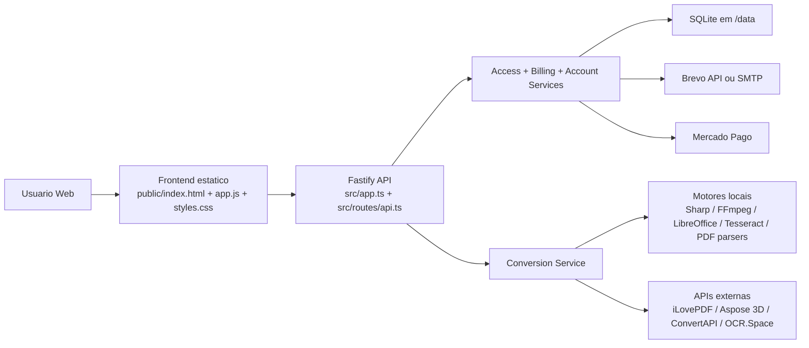
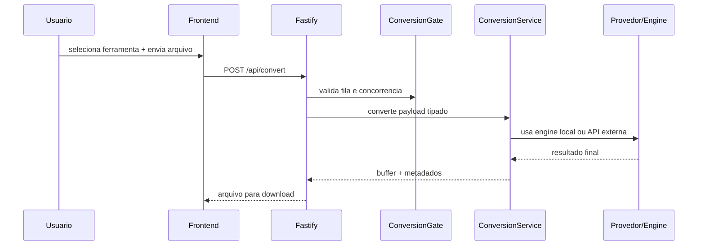
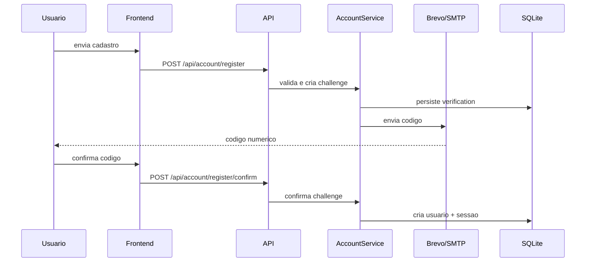

# 

`vaptdoc` e uma plataforma full-stack de conversao de arquivos com foco em:

- conversoes rapidas com fallback local e provedores externos
- OCR e fluxos PDF avancados
- autenticacao de conta, verificacao por codigo e monetizacao
- seguranca, observabilidade e operacao pronta para Railway

O projeto foi estruturado para que outros desenvolvedores consigam:

- entender a arquitetura rapidamente
- subir o ambiente local ou em nuvem
- trocar provedores de integracao
- adicionar novas ferramentas de conversao sem quebrar o restante

## Visao Geral



## O que o `vaptdoc` faz hoje

- Conversao de documentos: `PDF -> DOCX`, `DOCX -> PDF`, `Office -> PDF`, `PDF -> TXT`
- Conversao de imagem: `JPG/JPEG -> PNG`, `PNG -> JPG/JPEG`, `Imagem -> PDF`
- Audio e video: `MP4 -> MP3`
- Workflows PDF avancados: unir, dividir, compactar, OCR, reparar, validar PDF/A, marca d'agua, paginacao, rotacao, extracao avancada, editar, proteger, desbloquear
- Conversao 3D com Aspose
- Conta de usuario com:
  - cadastro e login
  - verificacao por codigo
  - troca de e-mail e senha por confirmacao
  - avatar
  - sessao persistente
- Monetizacao com:
  - plano gratis
  - plano Pro / Team
  - checkout Mercado Pago
  - codigos de acesso
  - creditos e descontos
- Painel administrativo para o dono do sistema

## Stack Tecnologica

### Backend

- Node.js `>= 24`
- TypeScript
- Fastify
- Zod
- SQLite

### Frontend

- HTML estatico
- CSS customizado
- JavaScript vanilla modularizado por convencao

### Conversao e processamento

- `sharp`
- `ffmpeg-static`
- `pdf-parse`
- `docx`
- `aspose.3d`
- `@ilovepdf/ilovepdf-nodejs`
- `convertapi`

### Conta, billing e e-mail

- Mercado Pago
- Brevo API ou SMTP

### Testes e build

- Vitest
- TypeScript compiler
- tsup

## Estrutura do Projeto

```text
transmuta-lab/
  public/                  # App web, estilos, assets, paginas legais
  src/
    routes/                # Rotas HTTP da API
    services/              # Regras de negocio e integracoes
    utils/                 # Utilitarios de seguranca, fila, arquivos, layout
    app.ts                 # Composicao principal do Fastify
    server.ts              # Bootstrap do servidor
    catalog.ts             # Catalogo de ferramentas
    seo.ts                 # SEO, sitemap, robots e JSON-LD
    env.ts                 # Validacao das variaveis de ambiente
    types.ts               # Tipos compartilhados
  scripts/                 # Automacoes locais e smoke tests
  tests/                   # Suite Vitest
  Dockerfile               # Build/deploy em Railway
  railway.toml             # Configuracao do servico Railway
```

## Documentacao Tecnica

- [Arquitetura](docs/ARCHITECTURE.md)
- [API HTTP](docs/API.md)
- [Ferramentas e matriz de conversao](docs/TOOLS.md)
- [Integracoes externas](docs/INTEGRATIONS.md)
- [Deploy e ambiente](docs/DEPLOYMENT.md)
- [Contribuindo](CONTRIBUTING.md)
- [Seguranca operacional](SECURITY.md)

## Setup Local Rapido

### 1. Requisitos

- Node.js `24+`
- npm
- Opcional para mais fidelidade local:
  - LibreOffice
  - Tesseract OCR
  - pdftoppm
  - FFmpeg

### 2. Instale dependencias

```bash
npm install
```

### 3. Configure ambiente

Copie `.env.example` para `.env` e preencha as variaveis necessarias:

```bash
cp .env.example .env
```

### 4. Rode em modo dev

```bash
npm run dev
```

### 5. Validacao local

```bash
npm run lint
npm test
npm run build
```

## Variaveis de Ambiente Principais

### Nucleo

```env
NODE_ENV=development
HOST=0.0.0.0
PORT=3000
DATA_DIR=./data
PUBLIC_APP_URL=http://localhost:3000
```

### Limites operacionais

```env
MAX_FILE_SIZE_MB=25
MAX_OCR_PAGES=8
MAX_CONCURRENT_CONVERSIONS=3
MAX_PENDING_CONVERSIONS=12
```

### Conta, planos e admin

```env
ACCESS_TOKEN_SECRET=
ACCOUNT_SESSION_DAYS=30
FREE_DAILY_LIMIT=8
PRO_DAILY_LIMIT=80
PRO_ACCESS_DAYS=30
TEAM_ACCESS_DAYS=365
ADMIN_OWNER_EMAILS=voce@seudominio.com
```

### Billing

```env
BILLING_STATE_SECRET=
MERCADOPAGO_ACCESS_TOKEN=
MERCADOPAGO_WEBHOOK_SECRET=
PRO_MONTHLY_PRICE_BRL=19.9
PRO_YEARLY_PRICE_BRL=149.9
STARTER_PACK_PRICE_BRL=9.9
STARTER_ACCESS_DAYS=7
```

### E-mail

```env
BREVO_API_KEY=
EMAIL_FROM_ADDRESS=noreply@seudominio.com
EMAIL_FROM_NAME=vaptdoc
```

### Integracoes de conversao

```env
ILOVEPDF_PUBLIC_KEY=
ILOVEPDF_SECRET_KEY=
ILOVEPDF_OCR_LANGUAGES=por,eng
ASPOSE3D_CLIENT_ID=
ASPOSE3D_CLIENT_SECRET=
CONVERTAPI_TOKEN=
OCR_SPACE_API_KEY=
OCR_SPACE_LANGUAGE=por
```

## Fluxos importantes

### Conversao



### Criacao de conta



## Estado da Qualidade

O projeto inclui:

- validacao forte de ambiente via Zod
- rate limit
- CSP e headers de seguranca
- verificacao de upload e tamanho
- logs estruturados de conversao
- healthcheck e readiness
- testes automatizados
- smoke test publico

## Observacoes para contribuidores

- O frontend e intencionalmente sem framework
- O catalogo de ferramentas fica centralizado em `src/catalog.ts`
- Toda nova rota deve entrar com validacao e testes
- Toda integracao nova deve ter fallback ou erro claro

## Publicacao

Este repositório foi preparado para colaboracao tecnica. Antes de abrir para uso amplo, revise:

- segredos e credenciais
- dominio e remetente de e-mail
- politicas de licenca que deseja aplicar
