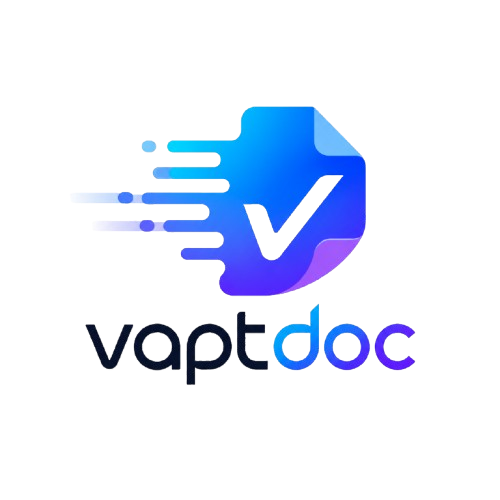
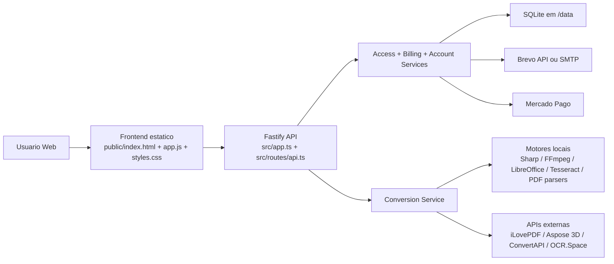
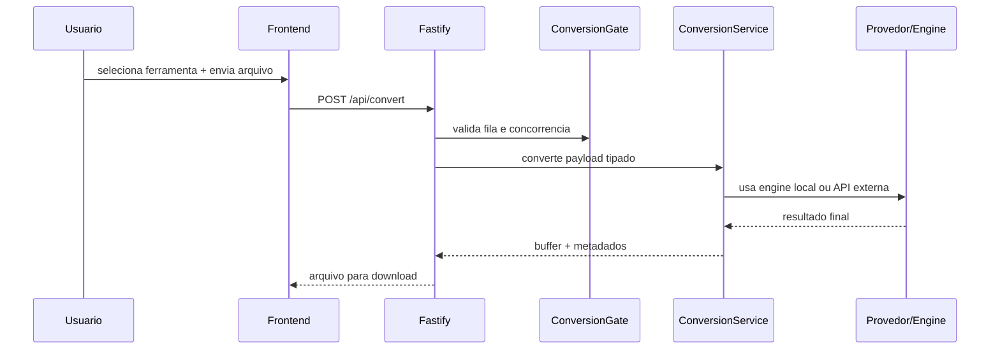
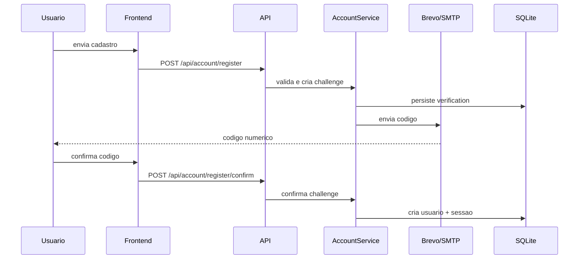

# 

`vaptdoc` e uma plataforma full-stack de conversao de arquivos com foco em:

- conversoes rapidas com fallback local e provedores externos
- OCR e fluxos PDF avancados
- autenticacao de conta, verificacao por codigo e monetizacao
- seguranca, observabilidade e operacao pronta para ambientes modernos de hospedagem

O projeto foi estruturado para que outros desenvolvedores consigam:

- entender a arquitetura rapidamente
- subir o ambiente local ou em nuvem
- trocar provedores de integracao
- adicionar novas ferramentas de conversao sem quebrar o restante

## Visao Geral



## O que o `vaptdoc` faz hoje

- Conversao de documentos: `PDF -> DOCX`, `DOCX -> PDF`, `Office -> PDF`, `PDF -> TXT`
- Conversao de imagem: `JPG/JPEG -> PNG`, `PNG -> JPG/JPEG`, `Imagem -> PDF`
- Audio e video: `MP4 -> MP3`
- Workflows PDF avancados: unir, dividir, compactar, OCR, reparar, validar PDF/A, marca d'agua, paginacao, rotacao, extracao avancada, editar, proteger, desbloquear
- Conversao 3D com Aspose
- Conta de usuario com:
  - cadastro e login
  - verificacao por codigo
  - troca de e-mail e senha por confirmacao
  - avatar
  - sessao persistente
- Monetizacao com:
  - plano gratis
  - plano Pro / Team
  - checkout Mercado Pago
  - codigos de acesso
  - creditos e descontos
- Painel administrativo para o dono do sistema

## Stack Tecnologica

### Backend

- Node.js `>= 24`
- TypeScript
- Fastify
- Zod
- SQLite

### Frontend

- HTML estatico
- CSS customizado
- JavaScript vanilla modularizado por convencao

### Conversao e processamento

- `sharp`
- `ffmpeg-static`
- `pdf-parse`
- `docx`
- `aspose.3d`
- `@ilovepdf/ilovepdf-nodejs`
- `convertapi`

### Conta, billing e e-mail

- Mercado Pago
- Brevo API ou SMTP

### Testes e build

- Vitest
- TypeScript compiler
- tsup

## Estrutura do Projeto

```text
transmuta-lab/
  public/                  # App web, estilos, assets, paginas legais
  src/
    routes/                # Rotas HTTP da API
    services/              # Regras de negocio e integracoes
    utils/                 # Utilitarios de seguranca, fila, arquivos, layout
    app.ts                 # Composicao principal do Fastify
    server.ts              # Bootstrap do servidor
    catalog.ts             # Catalogo de ferramentas
    seo.ts                 # SEO, sitemap, robots e JSON-LD
    env.ts                 # Validacao das variaveis de ambiente
    types.ts               # Tipos compartilhados
  scripts/                 # Automacoes locais e smoke tests
  tests/                   # Suite Vitest
  Dockerfile               # Imagem de producao conteinerizada
  railway.toml             # Exemplo de configuracao para Railway
```

## Documentacao Tecnica

- [Arquitetura](docs/ARCHITECTURE.md)
- [API HTTP](docs/API.md)
- [Ferramentas e matriz de conversao](docs/TOOLS.md)
- [Integracoes externas](docs/INTEGRATIONS.md)
- [Deploy e ambiente](docs/DEPLOYMENT.md)
- [Handover e Codex de Desenvolvimento](docs/HANDOVER_CODEX.md)
- [Relatorio de hardening de seguranca](docs/SECURITY_HARDENING_2026-06.md)
- [Contribuindo](CONTRIBUTING.md)
- [Seguranca operacional](SECURITY.md)

## Como rodar este projeto em qualquer ambiente

### 1. Requisitos

- Node.js `24+`
- npm
- Docker `24+` com Docker Compose opcional
- Opcional para desenvolvimento sem container:
  - LibreOffice
  - Tesseract OCR
  - pdftoppm
  - FFmpeg

### 2. Variaveis de ambiente

O projeto nao depende de secrets, portas ou URLs fixas no codigo. Tudo entra por variaveis de ambiente validadas em [src/env.ts](src/env.ts).

Comece copiando o modelo:

```bash
cp .env.example .env
```

Preencha somente o que for necessario para o ambiente em questao:

- `PORT`: porta dinamica fornecida pela hospedagem
- `PUBLIC_APP_URL`: URL publica final do ambiente
- `DATA_DIR`: caminho persistente do SQLite e arquivos de apoio
- credenciais das integracoes que voce realmente vai usar

> O `.env.example` lista todas as variaveis suportadas com valores vazios, para que cada ambiente possa definir seus proprios valores sem depender de defaults locais.

### 3. Rodando sem Docker

Instale as dependencias:

```bash
npm install
```

Suba em desenvolvimento:

```bash
npm run dev
```

Valide antes de publicar:

```bash
npm run lint
npm test
npm run build
```

### 4. Rodando com Docker

Crie a imagem de producao:

```bash
docker build -t vaptdoc .
```

Suba o container apontando um `.env` e um volume persistente:

```bash
docker run --rm ^
  --env-file .env ^
  -e PORT=8080 ^
  -p 8080:8080 ^
  -v "%cd%/data:/data" ^
  vaptdoc
```

Notas importantes:

- o servidor sempre escuta a porta informada por `PORT`
- o `Dockerfile` usa build multi-stage para manter a imagem final mais enxuta
- o volume em `/data` evita perder o banco SQLite entre reinicios

## Variaveis de Ambiente Principais

Estas sao as categorias mais importantes. A lista completa e oficial fica em [.env.example](.env.example).

### Nucleo

```env
NODE_ENV=
HOST=
PORT=
DATA_DIR=
PUBLIC_APP_URL=
```

### Limites operacionais

```env
MAX_FILE_SIZE_MB=
MAX_OCR_PAGES=
MAX_CONCURRENT_CONVERSIONS=
MAX_PENDING_CONVERSIONS=
```

### Conta, planos e admin

```env
ACCESS_TOKEN_SECRET=
ACCOUNT_SESSION_DAYS=
ADMIN_SESSION_HOURS=
ADMIN_ELEVATION_MINUTES=
LOGIN_FAILURE_LIMIT=
LOGIN_LOCK_MINUTES=
SECURITY_ALLOWED_ORIGINS=
TURNSTILE_SITE_KEY=
TURNSTILE_SECRET_KEY=
TURNSTILE_ALLOWED_HOSTNAMES=
TURNSTILE_REQUIRED=
FREE_DAILY_LIMIT=
PRO_DAILY_LIMIT=
PRO_ACCESS_DAYS=
TEAM_ACCESS_DAYS=
PRO_ACCESS_CODES=
TEAM_ACCESS_CODES=
ADMIN_OWNER_EMAILS=
```

### Billing

```env
BILLING_STATE_SECRET=
MERCADOPAGO_ACCESS_TOKEN=
MERCADOPAGO_WEBHOOK_SECRET=
PRO_MONTHLY_PRICE_BRL=
PRO_YEARLY_PRICE_BRL=
STARTER_PACK_PRICE_BRL=
STARTER_ACCESS_DAYS=
```

### E-mail

```env
BREVO_API_KEY=
SMTP_HOST=
SMTP_PORT=
SMTP_SECURE=
SMTP_USER=
SMTP_PASS=
EMAIL_FROM_ADDRESS=
EMAIL_FROM_NAME=
```

### Integracoes de conversao

```env
ILOVEPDF_PUBLIC_KEY=
ILOVEPDF_SECRET_KEY=
ILOVEPDF_OCR_LANGUAGES=
ASPOSE3D_CLIENT_ID=
ASPOSE3D_CLIENT_SECRET=
CONVERTAPI_TOKEN=
OCR_SPACE_API_KEY=
OCR_SPACE_LANGUAGE=
LIBREOFFICE_BIN=
PDFTOPPM_BIN=
TESSERACT_BIN=
FFMPEG_BIN=
MALWARE_SCAN_BIN=
MALWARE_SCAN_REQUIRED=
MAX_IMAGE_PIXELS=
MAX_ARCHIVE_ENTRIES=
MAX_ARCHIVE_RATIO=
```

### Backups criptografados

```env
BACKUP_ENCRYPTION_KEY=
```

## Seguranca operacional

O backend aplica controles de seguranca no limite da API, nao apenas no frontend:

- CSRF assinado em cookie `vaptdoc-csrf` e header `X-CSRF-Token` para metodos mutaveis.
- Validacao de origem para impedir chamadas cross-site fora de `PUBLIC_APP_URL` e `SECURITY_ALLOWED_ORIGINS`.
- Bloqueio progressivo de login por e-mail/IP via `LOGIN_FAILURE_LIMIT` e `LOGIN_LOCK_MINUTES`.
- Turnstile opcional para cadastro e login. Defina `TURNSTILE_REQUIRED=true`, `TURNSTILE_SITE_KEY` e `TURNSTILE_SECRET_KEY` para exigir anti-bot em producao.
- Sessoes administrativas mais curtas via `ADMIN_SESSION_HOURS`.
- Mutacoes administrativas sensiveis exigem reautenticacao temporaria via `ADMIN_ELEVATION_MINUTES`.
- `/health` publico retorna apenas status basico; diagnostico detalhado fica em `/api/admin/system/health`.
- Swagger JSON fica protegido em producao e so abre para administradores autenticados.

### Verificacao de uploads

Uploads sao validados por tipo real, tamanho e propriedades de conteudo antes da conversao:

- `MAX_FILE_SIZE_MB` limita o tamanho bruto.
- `MAX_IMAGE_PIXELS` limita imagens gigantes e evita decompression bombs.
- `MAX_ARCHIVE_ENTRIES` e `MAX_ARCHIVE_RATIO` reduzem risco em arquivos ZIP/Office/PDF empacotados.
- `MALWARE_SCAN_BIN` permite plugar um scanner externo, como ClamAV. Se `MALWARE_SCAN_REQUIRED=true`, o servidor falha ao iniciar sem scanner configurado.

### Backups

Os scripts de backup criam arquivos criptografados e verificaveis:

```bash
npm run backup:create
npm run backup:verify -- --file backups/arquivo.vaptdoc-backup
npm run backup:restore -- --file backups/arquivo.vaptdoc-backup --target data-restaurado
```

Use uma chave forte e exclusiva em `BACKUP_ENCRYPTION_KEY`. Nao reutilize `ACCESS_TOKEN_SECRET` ou `BILLING_STATE_SECRET`.

## Fluxos importantes

### Conversao



### Criacao de conta



## Estado da Qualidade

O projeto inclui:

- validacao forte de ambiente via Zod
- rate limit
- CSP e headers de seguranca
- verificacao de upload e tamanho
- logs estruturados de conversao
- healthcheck e readiness
- testes automatizados
- smoke test publico

## Observacoes para contribuidores

- O frontend e intencionalmente sem framework
- O catalogo de ferramentas fica centralizado em `src/catalog.ts`
- Toda nova rota deve entrar com validacao e testes
- Toda integracao nova deve ter fallback ou erro claro

## Publicacao

Este repositório foi preparado para colaboracao tecnica. Antes de abrir para uso amplo, revise:

- segredos e credenciais
- dominio e remetente de e-mail
- politicas de licenca que deseja aplicar
