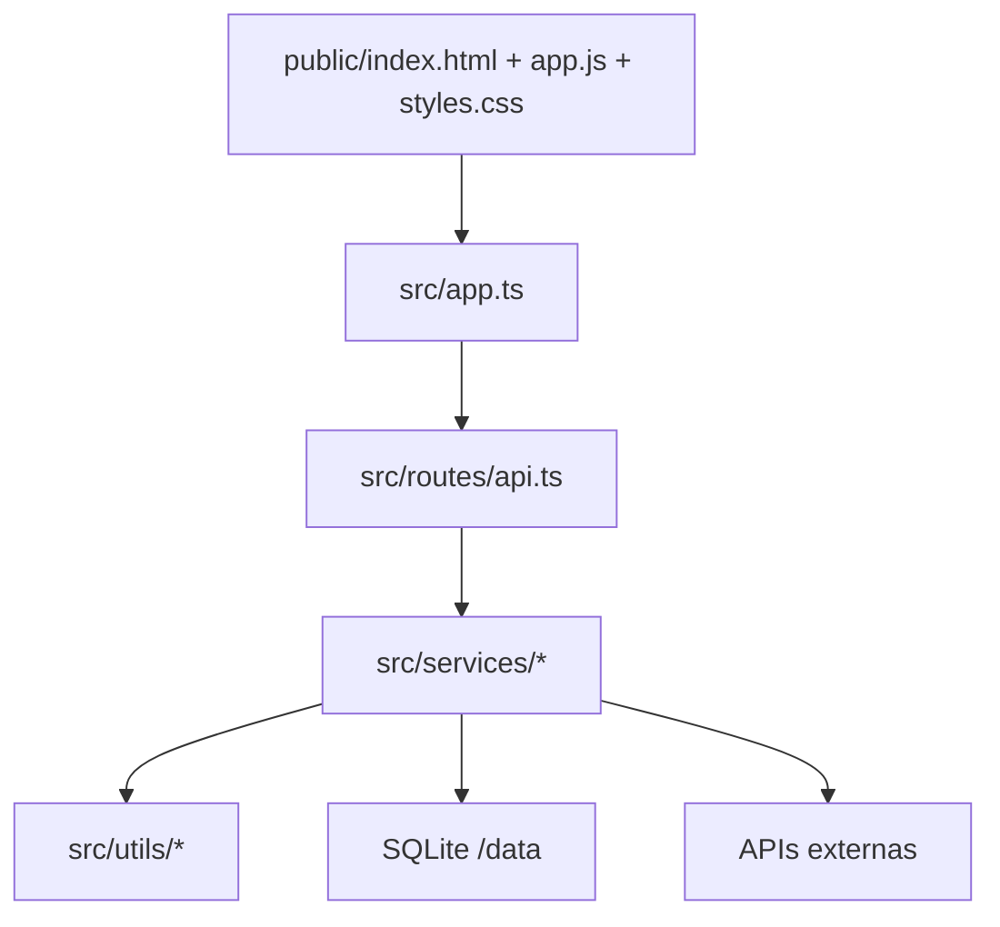

# Arquitetura do `vaptdoc`

## Visao por camadas



## Camada Web

### `public/`

- `index.html`: shell da aplicacao, modais, areas de workspace, JSON-LD bootstrap
- `app.js`: toda a logica de UI, filtros, conta, billing, upload, previews, drag and drop e requests
- `styles.css`: design system, responsividade, workspace, modais, admin e acessibilidade
- `privacy.html` e `terms.html`: documentos legais

## Camada de servidor

### `src/server.ts`

Arquivo minimo de bootstrap:

- cria a app Fastify via `createApp()`
- inicia `listen()`
- registra log inicial do servico

### `src/app.ts`

Ponto central de composicao:

- configura Fastify
- aplica `helmet`, `rate-limit`, `multipart`
- injeta servicos
- serve arquivos estaticos
- monta SEO dinamico
- expõe:
  - `/`
  - `/ferramenta/:toolId`
  - `/health`
  - `/readyz`
  - `/sitemap.xml`
  - `/robots.txt`

## Camada de rotas

### `src/routes/api.ts`

Aqui ficam:

- catalogo de ferramentas
- sessao publica
- conta
- billing
- admin
- conversao

Todos os endpoints:

- validam payload com Zod
- usam `Cache-Control: no-store` quando sensivel
- aplicam restricoes de origem para operacoes mutaveis
- retornam `AppError` com codigos padronizados

## Camada de servicos

### `conversion-service.ts`

Responsavel por:

- normalizar payloads de conversao
- escolher o provedor correto
- usar engines locais quando apropriado
- usar APIs externas quando necessarias
- devolver `Buffer`, `filename`, `contentType`, `provider`, `summary`

### `access-service.ts`

Controla:

- plano atual
- limites gratuitos diarios
- resgate de codigos
- sessao premium no navegador

### `account-service.ts`

Controla:

- cadastro
- login
- sessao autenticada
- avatar
- alteracao de perfil
- alteracao de e-mail
- alteracao de senha
- verificacao numerica por codigo
- ownership admin
- promo codes e trilha de admin

### `billing-service.ts`

Controla:

- criacao de checkout
- confirmacao do retorno
- reconciliacao de pagamento
- verificacao de assinatura do webhook

### `email-service.ts`

Controla:

- envio por Brevo API
- fallback SMTP
- provider `disabled` quando nada estiver configurado

### `aspose-3d-client.ts`

Cliente dedicado para Aspose 3D Cloud.

### `ilovepdf-client.ts`

Cliente dedicado para iLovePDF.

## Banco de dados

O banco atual e `SQLite`.

Local:

```text
./data/vaptdoc.sqlite
```

Em producao Railway:

```text
/data/vaptdoc/vaptdoc.sqlite
```

Tabelas principais:

- `users`
- `account_sessions`
- `account_plans`
- `account_verifications`
- `billing_payments`
- `promo_codes`
- `promo_redemptions`
- `admin_audit_log`

## Fila e controle de carga

`src/utils/conversion-gate.ts` controla:

- maximo de conversoes simultaneas
- fila pendente
- readiness do servico

## SEO e descoberta

`src/seo.ts` gera:

- meta title e description por ferramenta
- OpenGraph e Twitter tags
- JSON-LD `SoftwareApplication`
- JSON-LD `HowTo`
- `sitemap.xml`
- `robots.txt`

## Como adicionar uma nova ferramenta

1. Adicione a definicao em `src/catalog.ts`
2. Implemente a logica em `src/services/conversion-service.ts`
3. Adicione validacoes no backend se necessario
4. Confirme a renderizacao no workspace do frontend
5. Crie testes:
   - unidade
   - rota
   - smoke se aplicavel

## Principios arquiteturais

- tipagem forte no backend
- frontend sem framework, mas com organizacao modular por funcao
- configuracao por ambiente
- preferencia por fallback local seguro
- isolamento de integrações externas em servicos dedicados
