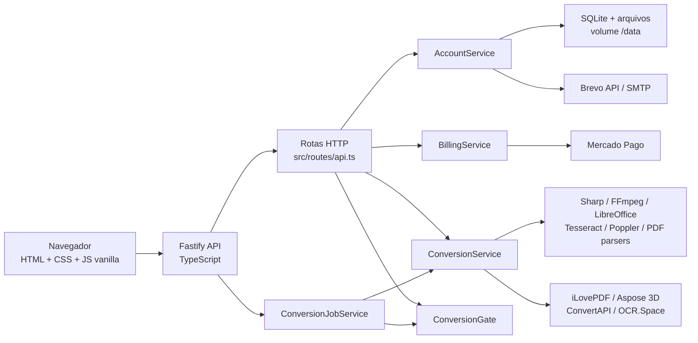
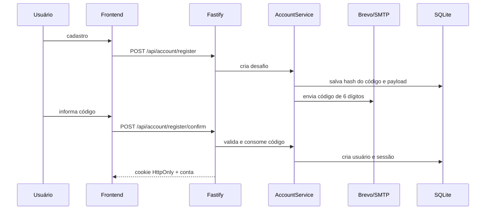

# Documento de Handover e Codex de Desenvolvimento do vaptdoc

> **Finalidade:** este documento é a fonte de contexto operacional para qualquer nova IA ou pessoa que assumir o desenvolvimento do projeto.
>
> **Data da auditoria:** 10 de junho de 2026.
>
> **Repositório oficial:** `https://github.com/Erick-Teixeira/vaptdoc`
>
> **Branch principal:** `main`
>
> **Produção:** `https://transmutalab.up.railway.app`
>
> **Serviço Railway:** `transmuta-lab-web`

---

## 0. Instrução de sistema para a próxima IA

Você está assumindo o desenvolvimento do **vaptdoc**, uma plataforma full-stack de conversão de arquivos, contas, monetização e administração. Trate este documento como contexto inicial obrigatório, mas confira o código e o estado remoto antes de alterar qualquer coisa, pois o repositório pode ter evoluído depois da data desta auditoria.

Regras fundamentais:

1. Leia este documento, `README.md`, `docs/ARCHITECTURE.md`, `docs/API.md`, `docs/INTEGRATIONS.md`, `docs/TOOLS.md`, `SECURITY.md` e `CONTRIBUTING.md`.
2. Inspecione o código existente antes de propor ou escrever alterações.
3. Não substitua arquivos por versões antigas e não restaure comportamentos removidos.
4. Preserve alterações do usuário e qualquer trabalho não relacionado presente no workspace.
5. Não mude domínio, provedor, preços, credenciais ou regras de negócio sem solicitação explícita.
6. Não exponha secrets em código, logs, documentação, commits, respostas, screenshots ou avisos da interface.
7. Implemente o pedido até o fim: código, testes, validação visual quando aplicável, commit, push e deploy quando a alteração afetar produção.
8. Rode no mínimo `node --check public/app.js`, `npm run lint`, `npm test` e `npm run build` antes de publicar alterações de código.
9. Use mensagens de commit no padrão Conventional Commits.
10. O usuário prefere que a IA execute o trabalho, em vez de apenas explicar como ele poderia ser feito.
11. Mudanças visuais devem ser verificadas em desktop e mobile, com atenção especial a Android, overflow, foco, modais e performance.
12. Antes de alterar áreas sensíveis, confira as invariantes de arquitetura, UX e segurança registradas neste documento.

O projeto **não possui dependência de runtime do Codex, OpenAI ou de qualquer IA de desenvolvimento**. Codex foi apenas o agente usado para construir e operar o repositório.

---

# 1. VISÃO GERAL DO PROJETO

## 1.1 Propósito

O vaptdoc é uma aplicação web para converter, organizar, editar e processar documentos, imagens, vídeo, áudio e modelos 3D. O produto busca unir:

- ferramentas rápidas de conversão;
- operações avançadas de PDF;
- OCR;
- conta de usuário;
- histórico e central de arquivos;
- fila para conversões pesadas;
- planos pagos, checkout, cupons e créditos;
- painel administrativo;
- SEO por ferramenta;
- experiência responsiva, com prioridade para mobile.

O problema resolvido é a fragmentação comum desse tipo de serviço: o usuário não precisa procurar um site diferente para cada formato, perde menos resultados e pode sair da página durante jobs pesados.

## 1.2 Estado atual

O sistema está funcional e publicado em produção no Railway.

Estado confirmado na auditoria:

- 27 ferramentas cadastradas;
- frontend responsivo em HTML, CSS e JavaScript vanilla;
- backend Fastify com TypeScript;
- SQLite persistente em volume Railway;
- cadastro, login e confirmação por código de e-mail;
- alterações de e-mail e senha confirmadas por código;
- avatar;
- planos Free, Pro e Team;
- checkout Mercado Pago;
- códigos de acesso e promoções;
- favoritos persistidos por conta;
- histórico de conversões;
- central de arquivos;
- downloads posteriores;
- fila assíncrona persistente para operações pesadas;
- notificações internas para jobs;
- uso detalhado por ferramenta;
- painel administrativo;
- auditoria administrativa persistida;
- i18n PT-BR e EN para a interface principal;
- previews de imagens e primeira página de PDFs;
- SEO dinâmico, sitemap, robots e JSON-LD;
- cache de conversão por SHA-256;
- Docker de produção;
- healthcheck e readiness;
- 78 testes automatizados passando.

## 1.3 Arquitetura de alto nível



## 1.4 Fluxo principal de conversão

1. O usuário acessa a home ou uma rota limpa de ferramenta.
2. Seleciona ou arrasta arquivo(s).
3. A página mostra uma única representação dos arquivos, sem upload redundante.
4. O botão principal de converter aparece somente quando há arquivo válido.
5. Ao clicar, abre-se o modal/tela de ajustes da ferramenta.
6. O usuário configura apenas opções relevantes para aquela conversão.
7. O frontend chama `/api/convert` ou `/api/convert/async`.
8. O backend valida acesso, uso, quantidade, tamanho e tipo real do arquivo.
9. A conversão passa pelo `ConversionGate`.
10. O resultado síncrono é baixado imediatamente; o assíncrono fica disponível na conta.

## 1.5 Fluxo de conta



## 1.6 Fluxo assíncrono

- Ferramentas assíncronas preferenciais: OCR, Conversor 3D e MP4 para MP3.
- Operações com quatro ou mais arquivos também podem ir para fila quando a ferramenta aceita múltiplos arquivos.
- Os inputs são persistidos em disco.
- O job é registrado em `account_conversion_history`.
- O `ConversionJobService` busca o próximo job e o executa no mesmo processo da API.
- Jobs `processing` antigos são devolvidos para `queued` na inicialização.
- Resultados ficam disponíveis por 14 dias.
- Notificações são criadas para conclusão ou falha das ferramentas assíncronas monitoradas.

## 1.7 Ferramentas cadastradas

1. `pdf-to-docx`
2. `3d-convert`
3. `docx-to-pdf`
4. `office-to-pdf`
5. `jpg-to-png`
6. `jpeg-to-png`
7. `png-to-jpg`
8. `png-to-jpeg`
9. `mp4-to-mp3`
10. `pdf-to-text`
11. `pdf-merge`
12. `pdf-split`
13. `pdf-compress`
14. `pdf-ocr`
15. `pdf-to-jpg`
16. `image-to-pdf`
17. `pdf-to-pdfa`
18. `html-to-pdf`
19. `pdf-validate-pdfa`
20. `pdf-rotate`
21. `pdf-unlock`
22. `pdf-protect`
23. `pdf-watermark`
24. `pdf-page-numbers`
25. `pdf-repair`
26. `pdf-extract`
27. `pdf-edit`

As definições ficam centralizadas em `src/catalog.ts`. Não duplique metadados de ferramentas em vários arquivos sem necessidade.

---

# 2. STACK TECNOLÓGICA E DEPENDÊNCIAS

## 2.1 Linguagens e arquitetura

- Node.js `>= 24`
- TypeScript `6.0.3`
- JavaScript ES Modules
- HTML5
- CSS3
- SQL SQLite
- Dockerfile multi-stage
- Shell operacional principal: PowerShell no Windows

## 2.2 Backend

Versões instaladas na auditoria:

| Pacote | Versão | Uso |
|---|---:|---|
| `fastify` | `5.8.5` | servidor HTTP |
| `@fastify/helmet` | `13.0.2` | headers e CSP |
| `@fastify/multipart` | `10.0.0` | uploads |
| `@fastify/rate-limit` | `10.3.0` | rate limiting |
| `@fastify/static` | `9.1.3` | assets públicos |
| `@fastify/swagger` | `9.7.0` | OpenAPI JSON |
| `zod` | `4.4.3` | validação de ambiente e payload |
| `dotenv` | `17.4.2` | `.env` local |
| `sanitize-filename` | `1.6.4` | nomes seguros |

## 2.3 Conversão e mídia

| Pacote | Versão | Uso |
|---|---:|---|
| `sharp` | `0.34.5` | imagens e assets |
| `ffmpeg-static` | `5.3.0` | vídeo/áudio |
| `pdf-parse` | `2.4.5` | leitura de PDF |
| `pdfjs-dist` | `6.0.227` | preview de PDF no navegador |
| `docx` | `9.6.1` | geração de DOCX |
| `aspose.3d` | `26.2.0` | conversão 3D local |
| `@ilovepdf/ilovepdf-nodejs` | `0.3.1` | operações iLovePDF |
| `convertapi` | `1.15.0` | fallback documental opcional |
| `file-type` | `22.0.1` | detecção real de arquivo |

## 2.4 Conta, e-mail e billing

| Pacote/serviço | Versão/forma | Uso |
|---|---|---|
| `node:sqlite` | integrado ao Node 24 | banco |
| `node:crypto` | integrado ao Node | hashes, tokens, HMAC, scrypt |
| `nodemailer` | `7.0.13` instalado | SMTP |
| Brevo API | HTTP | e-mail transacional preferencial |
| Mercado Pago | HTTP | checkout e confirmação |

## 2.5 Build e testes

| Pacote | Versão |
|---|---:|
| `tsx` | `4.21.0` |
| `tsup` | `8.5.1` |
| `vitest` | `4.1.5` |
| `@types/node` | `25.6.0` |
| `@types/nodemailer` | `8.0.0` |

## 2.6 Requisitos locais

Mínimo:

- Windows, Linux ou macOS;
- Node.js 24 ou superior;
- npm compatível;
- Git;
- acesso ao GitHub;
- Docker para reproduzir o ambiente de produção;
- Railway CLI para deploy.

Sem Docker, algumas ferramentas precisam de:

- LibreOffice (`soffice`);
- Java 17, necessário para partes do ecossistema 3D;
- Tesseract OCR com idiomas português e inglês;
- Poppler (`pdftoppm`);
- FFmpeg;
- fontes DejaVu.

O Docker instala:

```text
ca-certificates
ffmpeg
fonts-dejavu-core
libreoffice
openjdk-17-jdk-headless
poppler-utils
tesseract-ocr
tesseract-ocr-eng
tesseract-ocr-por
```

## 2.7 Comandos locais

```powershell
npm ci
Copy-Item .env.example .env
npm run dev
```

Validação:

```powershell
node --check public\app.js
npm run lint
npm test
npm run build
```

## 2.8 Variáveis de ambiente

Fonte oficial: `.env.example` e `src/env.ts`.

### Núcleo

```env
NODE_ENV=
HOST=
PORT=
DATA_DIR=
PUBLIC_APP_URL=
```

O servidor usa obrigatoriamente `env.PORT` e `env.HOST`. O default local de `PORT` é `3000`, mas hospedagens podem injetar qualquer porta.

### Limites

```env
MAX_FILE_SIZE_MB=
MAX_OCR_PAGES=
MAX_CONCURRENT_CONVERSIONS=
MAX_PENDING_CONVERSIONS=
CONVERSION_CACHE_TTL_SECONDS=
HEALTHCHECK_TIMEOUT_MS=
```

Defaults atuais:

- arquivo: 25 MB;
- OCR: 8 páginas;
- concorrência: 3;
- fila pendente: 12;
- cache: 600 segundos;
- probe externo: 3000 ms.

### Conta, acesso e admin

```env
ACCESS_TOKEN_SECRET=
ACCOUNT_SESSION_DAYS=
FREE_DAILY_LIMIT=
PRO_DAILY_LIMIT=
PRO_ACCESS_DAYS=
TEAM_ACCESS_DAYS=
PRO_ACCESS_CODES=
TEAM_ACCESS_CODES=
ADMIN_OWNER_EMAILS=
```

### Billing

```env
BILLING_STATE_SECRET=
BILLING_PRO_MONTHLY_URL=
BILLING_PRO_YEARLY_URL=
BILLING_STARTER_PACK_URL=
BILLING_SUPPORT_URL=
BILLING_WHATSAPP_URL=
PRO_MONTHLY_PRICE_BRL=
PRO_YEARLY_PRICE_BRL=
STARTER_PACK_PRICE_BRL=
STARTER_ACCESS_DAYS=
MERCADOPAGO_ACCESS_TOKEN=
MERCADOPAGO_WEBHOOK_SECRET=
```

### E-mail

```env
BREVO_API_KEY=
SMTP_HOST=
SMTP_PORT=
SMTP_SECURE=
SMTP_USER=
SMTP_PASS=
EMAIL_FROM_ADDRESS=
EMAIL_FROM_NAME=
```

Ordem de seleção:

1. Brevo API, se `BREVO_API_KEY` e remetente estiverem definidos;
2. SMTP, se host e remetente estiverem definidos;
3. provider desabilitado.

### Conversão

```env
ASPOSE3D_CLIENT_ID=
ASPOSE3D_CLIENT_SECRET=
ILOVEPDF_PUBLIC_KEY=
ILOVEPDF_SECRET_KEY=
ILOVEPDF_OCR_LANGUAGES=
CONVERTAPI_TOKEN=
OCR_SPACE_API_KEY=
OCR_SPACE_LANGUAGE=
LIBREOFFICE_BIN=
PDFTOPPM_BIN=
TESSERACT_BIN=
FFMPEG_BIN=
```

### Política de secrets

- Nunca preencher `.env.example` com valores reais.
- Nunca documentar tokens reais.
- Nunca consultar variáveis Railway imprimindo seus valores em logs compartilhados.
- Credenciais que já tenham aparecido em conversa, screenshot ou histórico devem ser rotacionadas se ainda estiverem ativas.
- Em produção, `ACCESS_TOKEN_SECRET` e `BILLING_STATE_SECRET` devem ser estáveis e fortes.
- O fallback automático de `resolveServerSecret` evita um secret fraco, mas um valor aleatório novo pode invalidar cookies após reinício. Não dependa do fallback em produção.

---

# 3. PADRÕES DE CÓDIGO E ARQUITETURA

## 3.1 Estrutura

```text
transmuta-lab/
  public/
    index.html
    app.js
    styles.css
    privacy.html
    terms.html
    assets/
      vendor/
        pdf.mjs
        pdf.worker.mjs
  src/
    routes/
      api.ts
    services/
      access-service.ts
      account-service.ts
      aspose-3d-client.ts
      billing-service.ts
      conversion-job-service.ts
      conversion-service.ts
      email-service.ts
      ilovepdf-client.ts
      usage-tracker.ts
    utils/
      conversion-gate.ts
      errors.ts
      file-validation.ts
      fs.ts
      process.ts
      secrets.ts
      text-layout.ts
    app.ts
    catalog.ts
    env.ts
    seo.ts
    server.ts
    tool-paths.ts
    types.ts
  tests/
  scripts/
  docs/
  Dockerfile
  railway.toml
  package.json
```

## 3.2 Responsabilidade dos arquivos

- `src/server.ts`: bootstrap mínimo; cria a app e escuta `HOST`/`PORT`.
- `src/app.ts`: composição Fastify, plugins, serviços, páginas, SEO, health e tratamento de erros.
- `src/routes/api.ts`: contrato HTTP, Zod, multipart, autorização, resposta.
- `src/catalog.ts`: fonte central das ferramentas, formatos, opções, acesso e UI metadata.
- `src/tool-paths.ts`: rotas SEO limpas geradas a partir do catálogo.
- `src/seo.ts`: metatags, JSON-LD, sitemap e robots.
- `src/services/*`: regra de negócio e integrações.
- `src/utils/*`: infraestrutura reutilizável.
- `public/index.html`: shell e estrutura semântica.
- `public/app.js`: estado e comportamento do frontend.
- `public/styles.css`: design system e responsividade.

## 3.3 Convenções TypeScript

- ESM, imports com extensão `.js` nos arquivos TypeScript.
- `strict: true`.
- Tipos compartilhados em `src/types.ts` quando atravessam serviços.
- Tipos específicos ficam próximos ao serviço.
- Funções e variáveis em `camelCase`.
- Classes e interfaces em `PascalCase`.
- IDs de ferramentas em `kebab-case`.
- Constantes de ambiente em `UPPER_SNAKE_CASE`.
- Serviços exportam factory quando apropriado, por exemplo `createAccountService`.
- Não use `any` como atalho; prefira `unknown`, narrowing e tipos explícitos.
- Não coloque lógica de provedor diretamente na rota se ela pertence a um service/client.

## 3.4 Tratamento de erros

Use `AppError`:

```ts
throw new AppError(
  "Mensagem segura para o usuário.",
  400,
  "CODIGO_ESTAVEL"
);
```

Regras:

- mensagens públicas não podem conter stack, token, credencial, caminho interno ou payload bruto;
- códigos de erro devem ser estáveis;
- erros 4xx previsíveis usam `AppError`;
- processos externos têm timeout;
- falha de persistência auxiliar não deve esconder o erro original da conversão;
- logs de conversão são estruturados;
- campos sensíveis de opções são substituídos por `[redacted]`;
- secrets conhecidos são removidos de mensagens e stacks antes do log.

## 3.5 Validação

- Toda variável de ambiente é validada em `src/env.ts`.
- JSON/body/query/params usam Zod.
- Multipart é validado por tamanho, quantidade e compatibilidade.
- Não confiar em extensão nem MIME declarado.
- `file-validation.ts` inspeciona magic bytes e estrutura de formatos.
- Nomes de download e arquivos persistidos são sanitizados.
- Opções enviadas são filtradas pela lista permitida da ferramenta.

## 3.6 Banco de dados

O projeto usa `DatabaseSync` de `node:sqlite`.

Configuração:

- `PRAGMA foreign_keys = ON`;
- WAL quando disponível;
- fallback para journal `DELETE`;
- `busy_timeout = 3000`;
- migrations incrementais simples por `CREATE TABLE IF NOT EXISTS` e `ALTER TABLE`.

Tabelas:

| Tabela | Responsabilidade |
|---|---|
| `users` | identidade, senha, avatar, créditos e desconto |
| `account_sessions` | sessões autenticadas com token hash |
| `account_verifications` | desafios de código por e-mail |
| `account_plans` | plano e validade |
| `billing_payments` | pagamentos reconciliados |
| `promo_codes` | regras de promoções |
| `promo_redemptions` | uso de promoções |
| `account_favorites` | favoritos persistentes |
| `account_conversion_history` | jobs, histórico e resultados |
| `account_notifications` | notificações internas |
| `admin_audit_log` | ações administrativas |

Persistência:

```text
Local:     ./data/vaptdoc.sqlite
Produção: /data/vaptdoc/vaptdoc.sqlite
```

Diretórios adicionais:

```text
DATA_DIR/conversion-inputs
DATA_DIR/conversion-history
```

Resultados e histórico são purgados após 14 dias.

## 3.7 Segurança de conta

- Senhas: `scrypt` com salt aleatório de 16 bytes.
- Comparações: `timingSafeEqual`.
- Sessão: token aleatório de 32 bytes; somente SHA-256 é armazenado.
- Cookies: `HttpOnly`, `SameSite=Lax`, `Secure` em produção.
- Códigos: seis dígitos, validade padrão de dez minutos.
- Reenvio: cooldown padrão de 60 segundos.
- Tentativas: máximo padrão de cinco.
- E-mail novo e senha nova exigem senha atual e código enviado.
- Admin: acesso somente se o e-mail normalizado estiver em `ADMIN_OWNER_EMAILS`.

Não enfraqueça esses controles.

## 3.8 Segurança HTTP

- Helmet e CSP.
- `frame-ancestors 'none'`.
- `object-src 'none'`.
- `form-action 'self'`.
- rate limit global e limites específicos.
- APIs sensíveis com `Cache-Control: no-store`.
- `Referrer-Policy: strict-origin-when-cross-origin`.
- `Permissions-Policy` desabilita câmera, microfone, geolocalização e browsing topics.
- mutações do frontend exigem `X-Vaptdoc-Client: web`;
- Mercado Pago usa estado HMAC e assinatura de webhook.

## 3.9 Arquitetura de conversão

- `ConversionService` recebe um `ConversionRequest` tipado.
- Uploads são detectados antes da execução.
- O service escolhe engine local ou externa.
- Integrações externas ficam em clientes próprios.
- O resultado padrão contém:
  - `data`;
  - `filename`;
  - `contentType`;
  - `provider`;
  - `summary`;
  - `warnings` opcionais.
- Cache em memória:
  - chave por SHA-256 de ferramenta, arquivos e opções;
  - TTL configurável;
  - retorno de cópia segura do resultado;
  - métricas no health snapshot.
- `ConversionGate` controla concorrência e fila.

## 3.10 Arquitetura de rotas e SEO

Cada ferramenta tem uma rota própria, gerada pelo catálogo:

```text
/pdf-para-docx
/dividir-pdf
/conversor-3d
...
```

A rota antiga `/ferramenta/:toolId` redireciona com `301`.

Não volte ao modelo de dashboard único em que todas as ferramentas carregam toda a lógica simultaneamente.

Cada rota deve:

- renderizar metatags específicas;
- manter H1 único;
- incluir FAQ curto;
- atualizar JSON-LD;
- entrar no sitemap;
- carregar somente a experiência necessária da ferramenta.

## 3.11 Invariantes de UX

Estas decisões foram solicitadas repetidamente e não devem ser desfeitas:

1. Layout compacto, simples, premium e direto.
2. Sem excesso de “caixas dentro de caixas”.
3. Sem duas áreas de upload na mesma tela.
4. Sem o mesmo arquivo exibido em dois lugares.
5. Sem bloco “Ferramenta ativa” nas conversões.
6. Sem card de plano dentro das telas de conversão.
7. O botão converter aparece após o upload.
8. O primeiro clique em converter abre os ajustes.
9. A conversão real acontece pelo botão dentro dos ajustes.
10. Ajuda rápida fica oculta até o usuário pedir.
11. Progresso aparece somente enquanto há upload/processamento real.
12. Não mostrar skeleton/modal vazio por cima da conversão.
13. Título e descrição da ferramenta ficam centralizados e respirados.
14. No diretório de ferramentas:
    - desktop mostra uma quantidade fixa de ferramentas populares;
    - mobile mostra seis cards;
    - mobile usa duas colunas;
    - não existe rolagem horizontal;
    - “Exibir todas as ferramentas” fica centralizado.
15. Tema fica dentro das configurações da conta, não fixo no header.
16. No mobile, menus e painéis importantes ocupam tela inteira.
17. O mobile não pode mostrar o conteúdo de fundo como uma janela transparente.
18. Telas mobile necessárias têm botão visual de fechar, sem sobreposição.
19. Avisos são toasts temporários e não ocupam espaço no fluxo.
20. Toasts aparecem somente para ação relevante, sucesso importante ou erro.
21. Não mostrar avisos passivos como “painel atualizado” ou “tela aberta”.
22. Nenhum toast pode exibir credencial, token, segredo ou erro interno.
23. O menu da conta usa “Meu Plano”.
24. Dados de perfil são acessados apenas por “Minha conta”; o item direto “Dados” foi removido.
25. A foto é alterada clicando no avatar; remover aparece nesse contexto.

## 3.12 Frontend e i18n

O frontend não usa framework.

Estado persistido em `localStorage`:

- idioma: `vaptdoc-locale`;
- favoritos locais/legados;
- checkout pendente.

O idioma pode ser:

- `pt-BR`;
- `en`.

O dicionário fica em `public/app.js`. Ao adicionar texto:

1. prefira uma chave semântica;
2. adicione PT-BR e EN;
3. use `t(key, variables)`;
4. atualize texto, placeholder e `aria-label`;
5. teste mudança sem reload quando possível.

Limitação atual: a tradução cobre a interface principal, mas ainda há textos de ajuda, FAQ, modais e mensagens dinâmicas em português. Não declare i18n como 100% completo.

## 3.13 Acessibilidade

- Todo botão sem texto deve ter `aria-label`.
- Use elementos nativos antes de simular botão.
- Foco por teclado deve ser visível.
- Modais usam `role="dialog"` e `aria-modal="true"`.
- Controles agrupados devem usar `radiogroup`, `tablist` ou labels apropriadas.
- Não dependa apenas de cor.
- Contraste deve buscar WCAG AA.
- Teste Tab, Shift+Tab, Enter, Espaço e Escape.

## 3.14 Performance

Prioridade máxima, especialmente mobile:

- não introduzir framework sem decisão arquitetural explícita;
- importar PDF.js sob demanda;
- revogar object URLs;
- usar previews pequenos e de tamanho fixo;
- não renderizar áreas invisíveis pesadas;
- evitar listeners duplicados;
- evitar reflow causado por avisos;
- manter cache de assets;
- otimizar imagens no build;
- não bloquear a thread principal com PDFs inteiros;
- manter conversões pesadas no backend/fila.

Hotspots atuais:

- `public/app.js`: aproximadamente 7.933 linhas;
- `public/styles.css`: aproximadamente 5.224 linhas;
- `public/index.html`: aproximadamente 1.555 linhas;
- `src/routes/api.ts`: aproximadamente 1.586 linhas;
- `src/services/account-service.ts`: aproximadamente 2.745 linhas;
- `src/services/conversion-service.ts`: aproximadamente 2.064 linhas.

Refatorações futuras devem ser incrementais, cobertas por testes e sem troca abrupta de stack.

## 3.15 API HTTP

### Sistema

- `GET /`
- `GET /<rota-limpa-da-ferramenta>`
- `GET /ferramenta/:toolId`
- `GET /sitemap.xml`
- `GET /robots.txt`
- `GET /health`
- `GET /readyz`
- `GET /documentation/json`

### Catálogo e acesso

- `GET /api/tools`
- `GET /api/access/session`
- `POST /api/access/redeem`
- `POST /api/access/logout`

### Conta

- `GET /api/account/session`
- `PUT /api/account/favorites`
- `GET /api/account/history`
- `GET /api/account/history/:historyId/download`
- `GET /api/account/files`
- `DELETE /api/account/files/:historyId`
- `GET /api/account/usage`
- `GET /api/account/notifications`
- `POST /api/account/notifications/read`
- `GET /api/account/avatar`
- `POST /api/account/register`
- `POST /api/account/register/confirm`
- `POST /api/account/verification/resend`
- `POST /api/account/login`
- `PATCH /api/account/profile`
- `POST /api/account/profile/email`
- `POST /api/account/profile/confirm`
- `POST /api/account/avatar`
- `DELETE /api/account/avatar`
- `POST /api/account/password`
- `POST /api/account/password/confirm`
- `POST /api/account/logout`

### Admin

- `GET /api/admin/dashboard`
- `GET /api/admin/users`
- `GET /api/admin/users/:userId`
- `PATCH /api/admin/users/:userId/profile`
- `POST /api/admin/users/:userId/plan`
- `POST /api/admin/users/:userId/credits`
- `POST /api/admin/users/:userId/discount`
- `DELETE /api/admin/users/:userId`
- `GET /api/admin/promos`
- `POST /api/admin/promos`
- `PATCH /api/admin/promos/:code`
- `DELETE /api/admin/promos/:code`

### Billing

- `POST /api/billing/checkout`
- `POST /api/billing/confirm-return`
- `POST /api/billing/mercadopago/webhook`

### Conversão

- `POST /api/convert`
- `POST /api/convert/async`

## 3.16 Estado do painel administrativo

O dashboard calcula:

- total de usuários;
- usuários premium ativos;
- promoções ativas;
- créditos totais;
- pagamentos aprovados;
- receita aprovada;
- jobs em fila;
- jobs processando;
- ferramentas mais usadas.

Detalhe do usuário inclui:

- conta;
- plano;
- carteira;
- pagamentos recentes;
- cupons usados;
- consumo por ferramenta;
- conversões recentes.

Ações administrativas são gravadas em `admin_audit_log`, mas ainda não existe endpoint/tela para leitura da auditoria.

---

# 4. FLUXO DE TRABALHO E AUTOMAÇÃO

## 4.1 Antes de qualquer alteração

1. Confirme o diretório:

```powershell
Set-Location "C:\Users\Erick\OneDrive\Documentos\New project\transmuta-lab"
```

2. Leia os arquivos relacionados.
3. Pesquise referências com `rg`.
4. Confira o estado remoto:

```powershell
gh repo view Erick-Teixeira/vaptdoc
gh api repos/Erick-Teixeira/vaptdoc/commits?per_page=10
```

5. Confira Railway:

```powershell
npx @railway/cli status
npx @railway/cli service status --json
```

6. Não imprima variáveis de ambiente secretas.
7. Identifique impacto em:
   - backend;
   - frontend;
   - mobile;
   - banco/migration;
   - API;
   - documentação;
   - deploy.

## 4.2 Criação de feature

### Planejamento

1. Traduza o pedido em comportamento observável.
2. Liste invariantes que não podem mudar.
3. Localize a fonte de verdade existente.
4. Escolha a menor mudança arquitetural consistente.
5. Defina casos de sucesso, erro e segurança.
6. Defina teste unitário, rota e visual.

### Backend

1. Adicione tipos.
2. Adicione configuração em `env.ts` e `.env.example` se necessário.
3. Encapsule integração em `services`.
4. Use `AppError`.
5. Adicione Zod na borda HTTP.
6. Não confie no frontend.
7. Atualize OpenAPI.
8. Adicione migration compatível com bancos existentes.
9. Teste banco novo e banco legado.

### Nova ferramenta

1. Defina em `src/catalog.ts`.
2. Adicione tipos de opções em `src/types.ts`.
3. Implemente no `ConversionService`.
4. Atualize validação de arquivo se houver formato novo.
5. Garanta rota limpa.
6. Adicione SEO/FAQ.
7. Adicione tradução.
8. Adicione teste à matriz.
9. Teste arquivo válido, inválido, vazio, grande e formato incompatível.

### Frontend

1. Reutilize o shell existente.
2. Não crie upload ou preview duplicado.
3. Ajustes ficam no modal/tela de conversão.
4. Adicione PT-BR e EN.
5. Adicione ARIA.
6. Verifique desktop e mobile.
7. Meça visualmente overflow e quebra.
8. Não introduza aviso persistente.

## 4.3 Edição de arquivos

- Faça mudanças manuais com patch controlado.
- Não sobrescreva arquivos inteiros grandes para uma alteração pequena.
- Não reverta mudanças que não pertencem à tarefa.
- Não use comandos destrutivos de Git.
- Não edite banco de produção diretamente sem backup e plano de rollback.

## 4.4 Documentação

Atualize conforme a mudança:

| Mudança | Documento |
|---|---|
| arquitetura/camada | `docs/ARCHITECTURE.md` |
| endpoint/contrato | `docs/API.md` |
| integração/env | `docs/INTEGRATIONS.md`, `.env.example` |
| ferramenta/formato | `docs/TOOLS.md` |
| deploy/runtime | `docs/DEPLOYMENT.md`, `README.md` |
| segurança | `SECURITY.md` |
| processo de contribuição | `CONTRIBUTING.md` |
| contexto da próxima IA | este handover |

Não documente uma feature antes de ela existir.

## 4.5 Testes

### Suite obrigatória

```powershell
node --check public\app.js
npm run lint
npm test
npm run build
```

Estado da auditoria:

```text
13 arquivos de teste passaram
78 testes passaram
build ESM passou
```

### Organização dos testes

- `access-service.test.ts`: sessão e códigos de acesso.
- `account-routes.test.ts`: conta, verificação, arquivos, favoritos e rotas.
- `admin-routes.test.ts`: autorização e administração.
- `app.test.ts`: aplicação, health, SEO e rotas.
- `aspose-3d-client.test.ts`: cliente 3D.
- `billing-service.test.ts`: checkout, estado e webhook.
- `conversion-gate.test.ts`: concorrência e fila.
- `conversion-matrix.test.ts`: matriz de ferramentas.
- `conversion-service.test.ts`: execução e cache.
- `email-service.test.ts`: providers de e-mail.
- `file-validation.test.ts`: magic bytes e compatibilidade.
- `process.test.ts`: processos externos.
- `text-layout.test.ts`: layout de texto.

### Teste visual

Após mudança de frontend:

1. inicie o app;
2. abra no navegador;
3. teste desktop;
4. teste viewport mobile semelhante a Android;
5. abra e feche todos os painéis afetados;
6. teste teclado;
7. confira console;
8. confira overflow horizontal;
9. confira loading, sucesso e erro;
10. confira PT-BR e EN.

### Smoke de produção

```powershell
$env:SMOKE_BASE_URL="https://transmutalab.up.railway.app"
npm run smoke:public
```

O smoke verifica:

- `/health`;
- `/readyz`;
- `/api/tools`;
- `/`;
- `/pdf-para-docx`;
- `/sitemap.xml`;
- `/robots.txt`.

## 4.6 Git e GitHub

### Regra do usuário

Cada nova alteração deve ser commitada e enviada ao repositório oficial.

### Commits

Use Conventional Commits:

```text
feat: add account file filters
fix: prevent billing modal from opening on load
refactor: centralize profile access in account panel
chore: update deployment documentation
test: cover async conversion recovery
docs: add project handover codex
```

Um commit deve ser pequeno, coeso e explicar o resultado, não o processo mental.

### Situação especial do workspace

O diretório local auditado contém uma pasta `.git` incompleta:

```text
.git/
  hooks/
  info/
  config.lock
  description
```

Comandos Git normais podem responder “not a git repository”. Não tente consertar isso com `git reset --hard`, `git checkout --` ou remoção destrutiva.

### Fluxo seguro atual

1. Faça e teste a alteração no workspace principal.
2. Crie clone limpo em pasta temporária única:

```powershell
$stamp = Get-Date -Format "yyyyMMdd-HHmmss"
$clone = Join-Path $env:TEMP "vaptdoc-$stamp"
git clone https://github.com/Erick-Teixeira/vaptdoc.git $clone
```

3. Copie apenas os arquivos intencionalmente alterados.
4. No clone:

```powershell
git status --short
git diff --stat
git diff --check
git diff
```

5. Configure identidade se necessário:

```powershell
git config user.name "Erick Teixeira"
git config user.email "erickgustavoteixeira2002@gmail.com"
```

6. Adicione explicitamente:

```powershell
git add -- caminho\do\arquivo
```

7. Commit e push:

```powershell
git commit -m "tipo: mensagem objetiva"
git push origin main
```

8. Confirme o commit remoto.

### Fluxo recomendado para corrigir no futuro

O ideal é substituir o workspace quebrado por um clone íntegro, preservando antes qualquer arquivo não commitado. Faça isso somente com autorização e backup.

## 4.7 Publicação no Railway

### Estado atual

- projeto: `Transmuta Lab`;
- ambiente: `production`;
- serviço: `transmuta-lab-web`;
- builder: Dockerfile;
- Runtime V2;
- healthcheck: `/health`;
- timeout: 300 segundos;
- restart: `ON_FAILURE`, 10 tentativas;
- uma réplica em `us-west2`;
- volume: `/data`;
- volume total: 500 MB;
- uso observado na auditoria: aproximadamente 53,4 MB;
- domínio Railway: `transmutalab.up.railway.app`;
- domínio customizado: nenhum.

### Deploy

Antes:

```powershell
npm run lint
npm test
npm run build
```

Publicar:

```powershell
npx @railway/cli up --service transmuta-lab-web --detach
```

Monitorar:

```powershell
npx @railway/cli service status --json
npx @railway/cli deployment list --json
```

Espere `SUCCESS`. Não considere publicado apenas porque o upload terminou.

Depois:

```powershell
$env:SMOKE_BASE_URL="https://transmutalab.up.railway.app"
npm run smoke:public
```

Também valide manualmente:

- home;
- uma ferramenta gratuita;
- uma ferramenta Pro;
- login;
- conta;
- idioma;
- upload e preview;
- `/health`;
- console do navegador.

### Ordem recomendada

1. testes locais;
2. clone limpo;
3. copiar diff;
4. revisar diff;
5. commit;
6. push;
7. deploy exatamente do mesmo conteúdo;
8. esperar healthcheck;
9. smoke;
10. validação visual.

Historicamente alguns deploys foram feitos antes do commit por causa do `.git` quebrado. Evite essa divergência: o código publicado e o commit devem ser idênticos.

### Rollback

Se produção quebrar:

1. não altere o banco às cegas;
2. preserve logs e ID do deployment;
3. identifique o último deployment `SUCCESS`;
4. reverta com um novo commit explícito ou redeploy do commit anterior;
5. valide `/health`, `/readyz` e smoke;
6. confirme compatibilidade de schema antes de voltar código antigo.

Nunca faça rollback de banco sem backup.

---

# 5. STATUS ATUAL E ROADMAP

## 5.1 Último commit

Commit remoto confirmado:

```text
894c83e0e663ae5d721bd5476db7e6a35bb8e34b
refactor: centralize profile access in account panel
2026-06-10T01:34:55Z
```

O commit removeu o acesso direto “Dados” do menu e manteve edição/visualização de perfil dentro de “Minha conta”.

Commits recentes relevantes:

```text
0d875e7d feat: complete interface language switching
6c25bda3 feat: expose language selector in account menu
ea1c80f9 fix: keep document preview thumbnail compact
3d630a08 fix: render uploaded pdf preview reliably
b998441b fix: include build tooling in Docker image
5aafad7b feat: improve ux, previews, caching and pricing
3f8c7908 chore: refatoração de infraestrutura para portabilidade e conteinerização (Docker + ENV)
7f4eabca Fix legacy account history migration
e9413ca5 Add files center, async jobs, usage metrics and notifications
31597626 Add history, queue, favorites, FAQ and better previews
4e6e68d3 Stop auto-opening billing screen on site load
```

## 5.2 Último deployment

```text
ID: f45a3d08-6e01-4a3f-9992-7da7d3a08ca7
Criado: 2026-06-10T01:27:24.374Z
Status: SUCCESS
Instância: RUNNING
```

Observação: o commit foi criado alguns minutos depois do deploy. Antes de qualquer nova publicação, confirme se o conteúdo remoto e o conteúdo em produção continuam equivalentes.

## 5.3 Última validação

Executada nesta auditoria:

```text
node --check public/app.js: passou
npm run lint: passou
npm test: 78/78 passaram
npm run build: passou
```

O Node emitiu aviso de que `node:sqlite` ainda é experimental.

## 5.4 Bugs e limitações conhecidos

### Operação e repositório

1. A pasta `.git` do workspace principal está incompleta.
2. Não existe workflow GitHub Actions no repositório.
3. A documentação `API.md` e partes de `ARCHITECTURE.md` estão desatualizadas em relação às features recentes.
4. Há arquivos temporários/logs antigos no workspace que não devem ser commitados.

### Escalabilidade

1. SQLite e o worker no mesmo processo limitam escalabilidade horizontal.
2. A aplicação usa uma única réplica; duas réplicas exigiriam coordenação de fila, cache, rate limit e banco.
3. `UsageTracker` é em memória:
   - zera no restart;
   - não é compartilhado entre réplicas;
   - não é fonte contábil permanente.
4. Rate limit e cache são locais ao processo.
5. A fila persistida sobrevive ao restart, mas não é um sistema distribuído.

### Billing e monetização

1. O webhook Mercado Pago é verificado, mas a rota atual apenas confirma a assinatura e retorna dados; ela não concede o plano por conta própria.
2. A ativação completa depende do fluxo de `confirm-return`. Se o usuário pagar e nunca retornar, pode ser necessária reconciliação manual.
3. Créditos existem na carteira e nas métricas, mas não são debitados automaticamente por conversão.
4. `estimatedCreditsUsed` é estimativa, não ledger financeiro.
5. Não existe trial automático de 1 ou 3 dias.
6. Não existe entitlement completo por recurso.
7. Cupons têm validade, máximo global e limite por usuário, mas não têm campanha/origem/UTM.
8. Busca admin atual é principalmente por e-mail e nome, não por plano, pagamento, status ou cupom.
9. A auditoria administrativa é gravada, mas não é consultável pela UI/API.

### Conta e segurança

1. Não existe fluxo “esqueci minha senha” para usuário deslogado.
2. Não existe exclusão self-service da conta.
3. O header `X-Vaptdoc-Client: web` é um marcador adicional, não uma proteção CSRF completa.
4. `SameSite=Lax` reduz risco, mas uma validação explícita de `Origin`/CSRF token seria hardening melhor.
5. O código numérico é armazenado como SHA-256 sem segredo adicional; como possui seis dígitos, um vazamento do banco permitiria brute force offline.
6. Hashes de IP e user-agent não usam chave secreta.
7. Não há política de complexidade de senha além de 8 a 128 caracteres.
8. Não há 2FA.
9. Não há backup automatizado documentado para o volume SQLite.

### Frontend

1. i18n ainda não cobre 100% dos textos.
2. `app.js`, `styles.css` e `index.html` são grandes e aumentam custo de manutenção.
3. Não há PWA:
   - sem manifest;
   - sem service worker;
   - sem instalação como app.
4. Não há recuperação completa de arquivos staged após fechar a aba.
5. Jobs já enviados são recuperáveis; uploads ainda não enviados não são.
6. Preview de PDF mostra a primeira página, não um navegador completo de páginas.
7. O frontend ainda depende de bastante DOM global e IDs fixos.

### Produto

1. Presets por objetivo ainda não existem.
2. Comparação antes/depois não está implementada como experiência completa e padronizada em todas as ferramentas.
3. Plano Team existe no domínio, mas a oferta pública principal anual é tratada como Pro anual.
4. A tabela de preços existe, mas deve ser revisada quando a diferença real entre Free, Pro e Team for consolidada.
5. Entrega de e-mail depende de remetente/domínio verificado no Brevo para boa reputação.

## 5.5 Roadmap imediato recomendado

### Prioridade 0: confiabilidade operacional

1. Reparar o workflow Git local com clone íntegro e backup.
2. Adicionar GitHub Actions:
   - `npm ci`;
   - lint;
   - testes;
   - build;
   - secret scan.
3. Criar backup automatizado e restauração testada do SQLite/volume.
4. Sincronizar toda a documentação.
5. Garantir que deploy use o mesmo commit enviado ao GitHub.

### Prioridade 1: billing

1. Persistir vínculo seguro entre checkout, conta e pagamento.
2. Fazer o webhook reconciliar e conceder plano de forma idempotente.
3. Criar job de reconciliação para pagamentos pendentes.
4. Criar ledger real de créditos.
5. Debitar créditos atomicamente.
6. Testar duplicidade de webhook, replay, atraso e retorno ausente.

### Prioridade 2: segurança

1. Implementar CSRF token ou validação robusta de Origin.
2. Proteger códigos de verificação com HMAC/pepper.
3. Adicionar “esqueci minha senha”.
4. Adicionar invalidação de todas as sessões após troca de senha.
5. Criar endpoint/tela de auditoria admin.
6. Automatizar dependabot/auditoria de dependências.
7. Rever retenção e privacidade de arquivos.

### Prioridade 3: performance e arquitetura

1. Persistir limite diário no banco.
2. Extrair módulos de `public/app.js`.
3. Separar CSS por domínio sem criar regressão de ordem/cascade.
4. Avaliar worker separado para jobs.
5. Medir Core Web Vitals e bundle real.
6. Adicionar testes E2E.

### Prioridade 4: produto

1. Completar i18n.
2. Implementar presets por objetivo.
3. Implementar PWA.
4. Implementar recuperação segura da sessão de upload.
5. Melhorar preview multipágina.
6. Implementar comparação antes/depois padronizada.
7. Consolidar diferenciação Free/Pro/Team.
8. Trial automático com regras antifraude.
9. Busca admin por filtros compostos.
10. Campanhas e atribuição de cupons.

## 5.6 O que não deve ser declarado como pronto

- PWA;
- recuperação de upload local após fechar a aba;
- trial automático;
- cobrança real por créditos;
- limites completos por recurso;
- webhook que concede plano de forma independente;
- auditoria admin consultável;
- i18n integral;
- CI/CD automatizado pelo GitHub;
- suporte seguro a múltiplas réplicas.

---

# 6. DIRETRIZES DE COMPORTAMENTO DA IA

## 6.1 Comunicação

Fale em português do Brasil.

Tom:

- claro;
- profissional;
- acolhedor;
- colaborativo;
- sem arrogância;
- direto ao ponto no encerramento.

Durante tarefas longas:

- informe o que está sendo investigado;
- compartilhe descobertas relevantes;
- avise antes de editar;
- não despeje logs inteiros;
- explique riscos reais;
- não peça ao usuário para fazer algo que a IA pode executar.

Resposta final:

- diga o que mudou;
- diga o que foi testado;
- diga se foi commitado, enviado e publicado;
- cite commit/deployment quando houver;
- informe qualquer risco ou etapa não executada.

## 6.2 Autonomia esperada

A IA deve proativamente:

- ler o código;
- localizar a causa;
- implementar;
- escrever/ajustar testes;
- rodar validações;
- revisar segurança da área alterada;
- revisar desktop/mobile em mudanças visuais;
- atualizar documentação;
- commitar;
- fazer push;
- publicar quando a mudança afeta produção;
- validar produção.

## 6.3 Quando perguntar

Pergunte antes de:

- mudar domínio;
- trocar provedor de pagamento;
- trocar banco de dados;
- alterar preços;
- alterar regras comerciais relevantes;
- apagar dados reais;
- executar migration destrutiva;
- remover funcionalidade;
- quebrar compatibilidade pública;
- rotacionar credenciais;
- mudar stack/framework;
- criar custo recorrente;
- habilitar serviço externo pago.

Se houver mais de uma solução com consequências importantes, apresente opções curtas e recomende uma.

## 6.4 O que nunca fazer

- Não expor secrets.
- Não commitar `.env`.
- Não commitar SQLite real.
- Não publicar chave de teste ou produção.
- Não mostrar stack interna ao usuário final.
- Não usar toast para credencial/erro crítico.
- Não reintroduzir menu “Dados”.
- Não reintroduzir tema fixo no header.
- Não abrir a tela de planos automaticamente.
- Não criar upload duplicado.
- Não mostrar arquivo duplicado na mesma ferramenta.
- Não mover ajustes de volta para a página abaixo do botão.
- Não usar modal transparente quebrado no mobile.
- Não substituir o frontend por versão antiga.
- Não fazer `git reset --hard`.
- Não usar `git checkout --` para apagar mudanças.
- Não sobrescrever trabalho do usuário.
- Não alegar que uma feature foi implementada sem confirmar o código e os testes.

## 6.5 Definição de pronto

Uma tarefa de código só está pronta quando:

1. o comportamento pedido existe;
2. não há alteração não solicitada;
3. casos de erro foram tratados;
4. segurança foi preservada;
5. testes foram adicionados/ajustados;
6. lint passou;
7. testes passaram;
8. build passou;
9. frontend foi validado quando aplicável;
10. documentação foi atualizada;
11. diff foi revisado;
12. commit foi criado;
13. push foi concluído;
14. deploy foi concluído quando necessário;
15. smoke de produção passou.

---

# 7. REFERÊNCIA OPERACIONAL RÁPIDA

## 7.1 Caminhos

```text
Workspace:
C:\Users\Erick\OneDrive\Documentos\New project\transmuta-lab

GitHub:
https://github.com/Erick-Teixeira/vaptdoc

Produção:
https://transmutalab.up.railway.app
```

## 7.2 Checklist de início

```powershell
Set-Location "C:\Users\Erick\OneDrive\Documentos\New project\transmuta-lab"
node --version
npm --version
npx @railway/cli status
gh repo view Erick-Teixeira/vaptdoc
```

## 7.3 Checklist de entrega

```powershell
node --check public\app.js
npm run lint
npm test
npm run build
```

Depois:

```powershell
git diff --check
git status --short
git commit -m "tipo: resumo"
git push origin main
npx @railway/cli up --service transmuta-lab-web --detach
```

Validar:

```powershell
npx @railway/cli service status --json
$env:SMOKE_BASE_URL="https://transmutalab.up.railway.app"
npm run smoke:public
```

## 7.4 Health

```text
GET /health
GET /readyz
GET /documentation/json
```

`/health` deve mostrar:

- status;
- limites;
- fila;
- iLovePDF;
- Aspose 3D;
- Mercado Pago;
- e-mail.

O `ConversionService` mantém métricas internas de cache, mas `src/app.ts` ainda não inclui esse bloco na resposta pública de `/health`. Expor essas métricas é uma melhoria pendente.

## 7.5 Princípio final

O objetivo não é apenas manter o site “funcionando”. O objetivo é preservar um produto:

- simples para o usuário;
- seguro para conta e pagamento;
- rápido no mobile;
- observável em produção;
- fácil de ampliar;
- coerente visualmente;
- fiel ao que já foi refinado.

Antes de qualquer mudança, pergunte ao código: **qual é a fonte de verdade, qual invariante pode ser quebrada e como vou provar que não houve regressão?**
